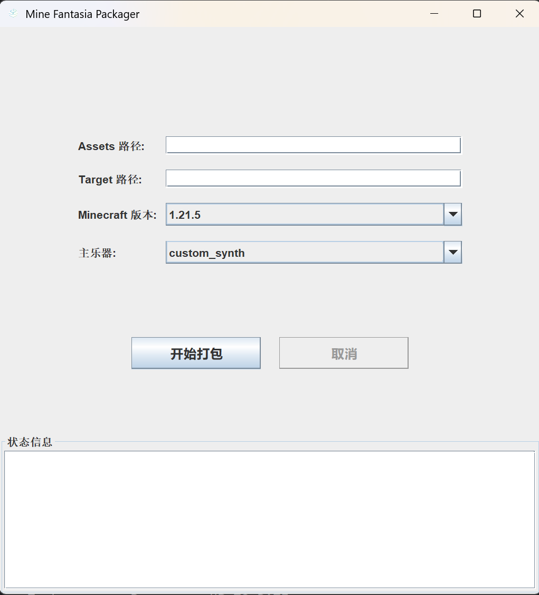

MFPackager
=======
这是一个用于创建我的世界模组：我的音乐幻想（MineFantasia）自定义乐器资源包的简易应用程序。

界面
=======

## Assets 路径

在此文本框中输入存有主乐器的所有子乐器的ogg文件的文件夹路径。

示例：假设有路径：

📁sounds 
├──📁example1 
│ ├──📄2a.ogg 
│ ├──📄2b.ogg 
│ └──...... 
├──📁example2 
│ ├──📄2a.ogg 
│ ├──📄2b.ogg 
└ └──...... 

如果你是为了打包一个自定义乐器，则你应该输入：`...\sounds`，之后包装器会自行处理相关逻辑。

如果你是为了打包一个模组内部乐器，则你应该输入具体的存放ogg文件的文件夹路径：`...\sounds\example1`,之后包装器会自行处理相关逻辑。

警告：请不要将空文件夹放入`sounds`文件夹中，否则应用可能报错或崩溃！

## Target 路径

在此文本框中输入生成的资源包和模组json文件的存放路径。路径要求与上方类似。

示例：假设有路径：`...\resource\output`，则在程序运行完成后，会在此路径下生成：

临时生成一个`generated`文件夹，存放运行时拷贝的文件，打包结束后（不论成功或者失败）均会删除。

如果是打包自定义乐器的资源包，则会生成所有的子乐器的模组`json`，你需要将这些json存放在你的Minecraft版本的`mods/minefantasia/ins`文件夹下。详情请前往我的音乐幻想主界面查看。

生成的资源包`zip`文件。其中已包含对应Minecraft版本的`pack.mcmeta`文件、符合`我的音乐幻想`模组要求的资源文件路径。

## Minecraft 版本

选择你的资源包要应用到的Minecraft版本。

## 主乐器

选择你的子乐器的主乐器。如果选择非自定义乐器，包装器会自动识别并完成包装。

##

如遇到任何问题，可前往发布issue。
